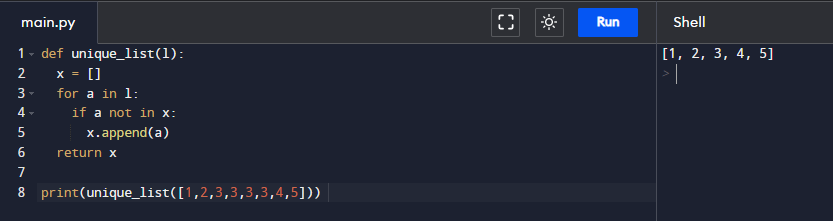
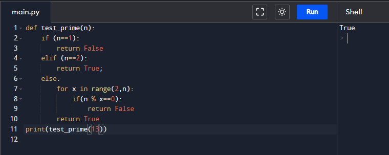
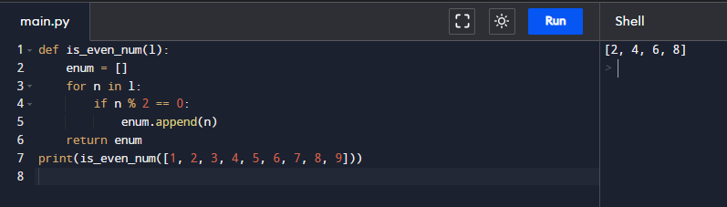
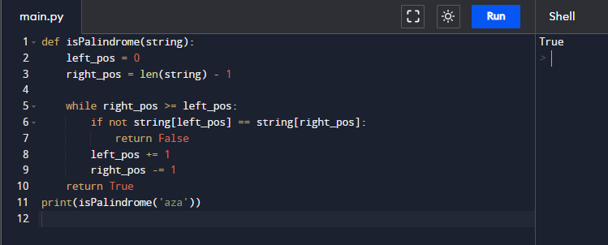
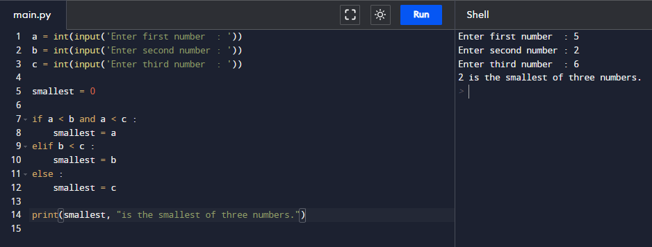
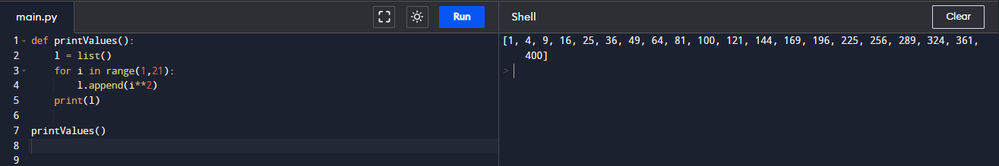
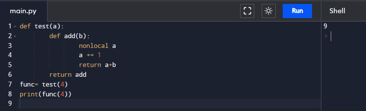
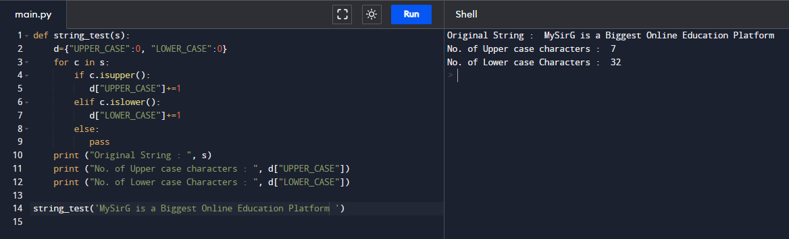
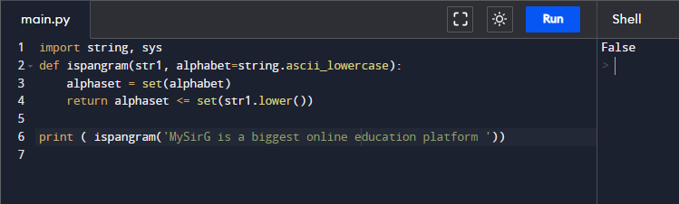
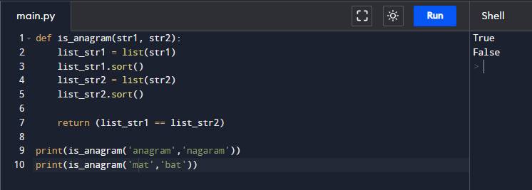

# Assignment - 20 Full Stack Web Development using Python MySirG More on functions

    Qns 1. Write a python program to create a function that takes a list and returns a new list with the original list's unique elements.

    Ans.

    Qns 2. Write a python program to create a function that takes a number as a parameter and checks if the number is prime or not.

    Ans.

    Qns 3. Write a python program to create a function that prints the even numbers from a
    given list.
    Sample List : [1, 2, 3, 4, 5, 6, 7, 8, 9]

    Ans.

    Qns 4. Write a python program to create a function that checks whether a passed string is palindrome or not.

    Ans.

    Qns 5. Write a python program to create a function to find the Min of three numbers.

    Ans.

    Qns 6. Write a python program to create a function and print a list where the values are square of numbers between 1 and 30.

    Ans.

    Qns 7. Write a python program to access a function inside a function.

    Ans.

    Qns 8. Write a python program to create a function that accepts a string and calculate the number of upper case letters and lower case letters.

    Ans.

    Qns 9. Write a python program to create a function to check whether a string is a pangram or not.

    Ans.

    Qns 10. Write a python program to create a function to check whether a string is an anagram or not.

    Ans.
